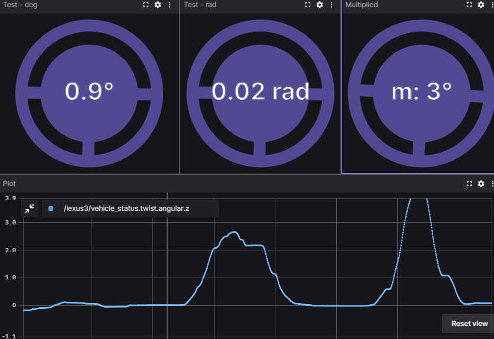

# Foxglove Wheel Extension

The Foxglove Wheel extension is a custom panel for Foxglove Studio that displays a rotating wheel based on incoming message data. It allows you to configure display options and conversion factors through a settings editor, making it ideal for visualizing steering commands or similar data.

## Features

- **Dynamic Rotation:** The wheel rotates in real-time based on incoming message values.
- **Configurable Display:** Customize font size, precision, and an optional title.
- **Message Conversion:** Apply a configurable scaling factor (provided as a string) to incoming message data.
- **Unit Selection:** Choose between degrees (`deg`) and radians (`rad`) for display.

## Basic installation

**Drag and drop the latest `.foxe` build from [the releases](https://github.com/jkk-research/foxglove-wheel/releases) on the foxglove extensions panel.**

## Local dev installation

1. **Clone the Repository:**  
   ` git clone https://github.com/jkk-research/foxglove-wheel `

2. **Install Dependencies:**  
   ` npm install `

3. **Build and install extension**  
   ` npm run local-install `

## Usage

After installation, open Foxglove Studio and add the Foxglove Wheel panel. Use the settings editor to configure the panel:

- **General Settings:**
  - **Font Size:** Adjust the size of the display text.
  - **Precision:** Set the number of decimal places for the rotation value.
  - **Title:** Optionally display a title before the rotation value.

- **Series Settings:**
  - **Message Path:** Specify the topic from which to receive message data (e.g. `/lexus3/pacmod/steering_cmd.command`).
  - **Unit:** Choose between `deg` or `rad`.
  - **Scaling Factor:** Enter a string (e.g. `"1.0"`) that is converted to a float to scale the incoming message value. (useful if yourdata is in a different unit, like wheel rotation)
